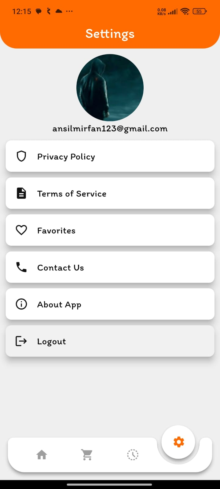
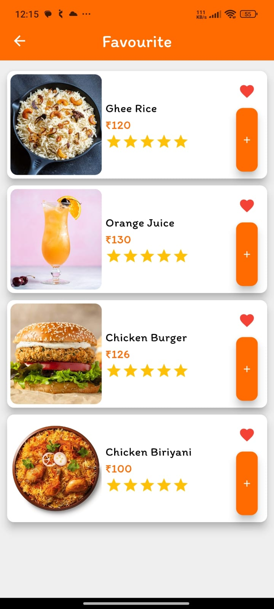

# Fork and Fusion

**Fork and Fusion** is a restaurant application designed to enhance the dining experience by allowing customers to scan QR codes from their tables, browse the restaurant menu, and order directly from their devices. The app streamlines ordering and minimizes wait times, providing a seamless e-commerce-like experience within the restaurant.

## Features

- **QR Code Scanning**  
  Users can scan QR codes placed on their tables to access the restaurant's menu instantly.

- **Digital Menu with Product Details**  
  The app provides a digital menu with comprehensive product descriptions, prices, and images to help users make informed decisions.

- **Easy Ordering Process**  
  Customers can add items to their cart, customize their orders (e.g., add-ons, quantity adjustments), and place orders directly from their table.

- **Cart Management**  
  Users can manage their cart by adding, removing, or updating item quantities before checkout.

- **Order Tracking**  
  Real-time order tracking allows users to stay informed on the status of their order as it progresses through preparation and delivery to their table.

- **User Account & Order History**  
  Users can create accounts, view their order history, and repeat past orders for convenience.

## Technologies Used

- **Frontend**: Flutter for cross-platform mobile app development.
- **Backend**: Firebase for authentication, database storage, and real-time updates.
- **QR Code Scanning**: `ai_barcode_scanner` for scanning QR codes at each table.
- **State Management**: `flutter_bloc` for efficient app state handling.
- **Image Caching**: `cached_network_image` for optimized image loading.
- **Navigation & UI**: `animated_notch_bottom_bar` for an enhanced bottom navigation experience.
- **Authentication**: `firebase_auth` and `google_sign_in` for user login and sign-up options.
- **Payment Integration**: `paypal_payment` for seamless online transactions.
- **Smooth Page Transitions**: `smooth_page_indicator` for an improved onboarding and carousel experience.

## App Screenshots

### Login Screen

### Home Screen Before Scanning

### Home Screen After Scanning

### Detailed View Screen

### Search Screen

### Order Screen

### Cart Screen

### Settings Screen

### Favourites Screen

### Add To Cart Bottomsheet

